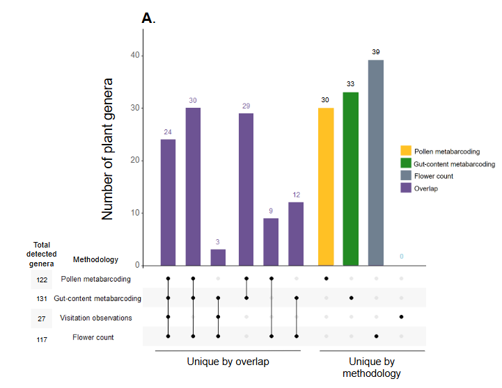
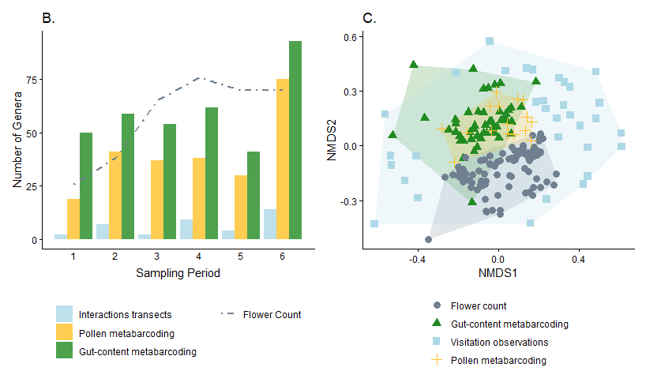
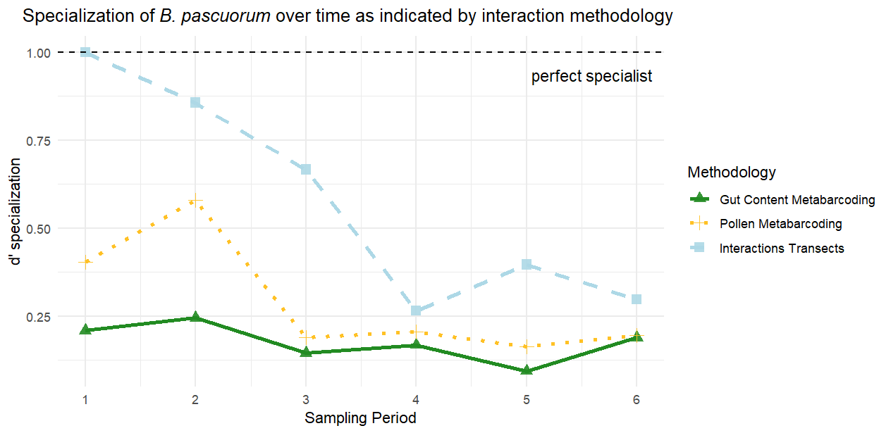
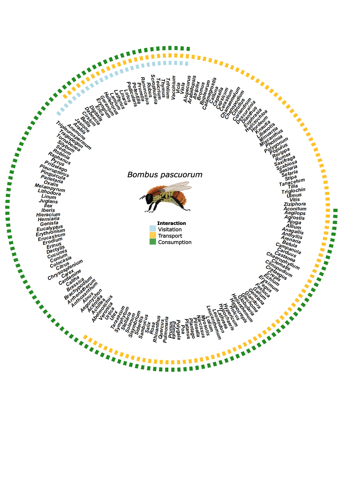

**Abstract**

Our understanding of plant-pollinator interaction networks hinges on the methods used to characterize the species and the interactions among them. Most networks are built from field observations that may overlook cryptic consumer–resource links, and often lack information describing the types and outcomes of these interactions, for example, whether resources are consumed directly by adults or transported to nests. To develop a more complete picture of interaction networks including functional context, we compare plant interactions from the wild pollinator species, *Bombus pascuorum*, recorded using three methodologies. We compare (1) floral visitation interactions obtained from field observations, (2) plant consumption interactions revealed by metabarcoding of gut contents, and (3) pollen transport interactions detected by metabarcoding analysis of corbicular pollen loads. We show that both metabarcoding approaches increase the number of interactions and reveal links that were overlooked by field observations, including plant taxa that are not pollinator-dependent, yet constitute important dietary resources. Paired with floral diversity surveys, gut-content results also reveal seasonal patterns in the spatial extent and functional diversity included in forage, which other methodologies fail to demonstrate. Metabarcoding methodologies capture greater spatial, temporal, and taxonomic ranges, while field observations provide validating data with higher taxonomic precision. Our results show that integrating visitation, transport, and consumption data changes network topology and the roles of plant nodes, offering a more nuanced and complete map of interactions with clearer priorities for management. We advocate for defining interactions explicitly by their functional roles and combining methods to account for hidden structure in ecological networks.

**Introduction**

Pollination is a critical ecosystem service that is currently threatened by global anthropogenic change, including habitat loss, intensifying agriculture, pathogens, and invasive species [@klein2006]. Despite the clear importance of understanding plant-pollinator interactions, our knowledge of interaction diversity remains incomplete, as the methodological approach to studying plant-pollinator interactions has historically been biased towards the plant side of interactions [@evans2020; @bosch2009]. As a consequence, the well-established relationship between pollinator diversity and the productivity of plant communities [@artamendi2025] lacks an equally developed mirrored perspective, describing the floral diversity that supports pollinator populations. 

Ecological network approaches provide a powerful framework for describing the diversity and organization of plant–pollinator interactions and identifying the resources that support pollinator communities [@burkle2011], however, existing methodologies for reconstructing interaction networks tend to emphasize structural patterns, while overlooking the functional outcomes of interactions that are critical for understanding how plant communities support pollinators [@quintero2022]. In *Apidae* species, for example, plant interactions may have several outcomes. Bees consume plant material, including pollen, nectar, or even plant tissue [@vaudo2015; @pashalidou2020]. They also collect pollen on their corbicula, which is transported to the nest for larvae [@leach2018; @vaudo2015]. Finally, visitation of the reproductive parts of flowers can have various outcomes for both the plant and pollinator, including pollen transfer [@emer2023] and pathogen transfer [@lignon2024]. Interaction networks generally represent only one of these outcomes, although each is important to understanding how plant taxa support pollinators, particularly across different life stages.

Because the resources needed for foraging adult pollinators are different from those needed by larvae or other colony members [@leach2018; @vaudo2015], transported pollen may not completely represent the interactions necessary to sustain adult pollinators. This is especially true for bumblebees (*Bombus spp.*), which are able to evaluate pollen resource quality to discern foraging choices [@leonhardt2012; @timberlake2024]. Bumblebees make trial-and-error floral visits in order to find adequate forage [@selva2024], sometimes resulting in pollen transport without consumption. Conversely, consumption, or simply visitation, may occur without resulting in transport [@popic2012].

Metagenomics, including metabarcoding, has emerged as a powerful tool for detecting plant-pollinator interactions that may be unobserved in pollen microscopy and field surveys [@lowe2022; @pornon2017; @bell2016], in some cases increasing interaction species detection by 9 - 144% [@milla2022; @baksay2022; @smart2017] and network sampling completeness up to 30%, while reducing exaggeration of specialization [@arstingstall2021], as well as revealing interactions beyond the traditionally surveyed floral community [@milla2022; @devere2017]. Advances in the reliability and accessibility of sequencing technologies have made molecular approaches more feasible for studying plant-pollinator interactions.

Most pollination studies applying metabarcoding focus on the external pollen loads of bees or pollen stored in nest reserves of honey or beebread [@selva2024; @devriese2024; @leponiemi2023; @baksay2022; @leontidou2021], despite the limitations of these sampling targets owed to environmental contamination [@negri2015]. Beyond potential contamination, externally transported pollen has an inherently restricted capacity for representing interaction types. For example, corbicular loads are made from pollen collected for transport to the nest for brood feeding [@leach2018; @vaudo2015], only directly representing pollen transport interactions [@arstingstall2021]. This pollen is often the central sample type used to represent foraging networks, where it is considered synonymous with diet and successful pollination interactions [@shi2025], likely overstating its functional role.

Pollinator intestinal tracts contain pollen and other plant material that can reveal interactions [@li2025; @haag2023; @mayr2021] with consumption as the exclusive outcome. There is an accumulating body of evidence supporting the idea that pollinators regularly search across functional groups of the plant community to meet their nutritional needs [@ibiyemi2025; @selva2024; @milla2022; @wood2022; @timberlake2024; @devere2017; @tanaka2020], although little attention has been given to these observations as a potentially important part of pollination studies [@saunders2018]. This understudied component of pollinator foraging together with the surprising lack of genetic analyses of pollinator gut contents, represents a clear knowledge gap.

We assess whether metabarcoding of pollinator gut contents can complement the characterization of plant-pollinator interaction networks described by more common methodologies, including field observations, and external pollen load metabarcoding. To this end, we compare interaction diversity and frequencies recorded by each of these methodologies for the wild bumblebee, *Bombus pascuorum*. Because gut contents directly reflect ingested resources, this approach may reveal interactions that are undetected by observational or external pollen-based methods. We therefore expect that gut metabarcoding will identify a unique group of plant taxa compared to those detected by other methodologies, while also showing partial overlap across approaches in the plant species interacting with bumblebees.

**Methods**

Our sample collection was conducted in Gorbeia Natural Park (coord: 43.068, -2.796), a protected area in N Spain. We selected 16 sampling sites located within the mixed zones of meadows and shrublands around or above 800 m a.sl.. We conducted fieldwork from early April to the end of July, 2023, covering the main flowering season and peak annual pollinator activity. Each site was visited six times throughout the flowering season, separated by approximately two-week periods. During each visit, we conducted three types of surveys: (1) floral diversity surveys (“flower counts”), (2) interaction transect surveys, and (3) *Bombus pascuorum* specimen collection for metabarcoding analyses.

For both interaction transect and flower count surveys we used one 250 m transect at each site, recording observations within a \~2 m wide transect line. Interaction surveys were conducted three times per day (\~11:00, \~13:00, \~15:00), each lasting 1 h. We recorded all observations of *Bombus pascuorum* individuals contacting the reproductive parts of herbaceous flowers. For each site and sampling period, one flower count was conducted by recording all of the flowering herbaceous species within the transect.

For every period visit at each site, we collected up to five *B. pascuorum* specimens for molecular analyses (N = 126). We brought specimens back from the field and froze them at -20°C until processed. In the lab, we extracted the entire gut and honey stomach and, if present, and collected pollen, when available, from the corbicula of specimens into sterile 1.5 mL centrifuge tubes. Pollen samples were stored individually by specimen sample at -20°C.

Genomic DNA was extracted from guts using the NucleoSpin® 96 Soil kit (Macherey-Nagel, Düren, Germany). We followed the kit manufacturer protocol, only adjusting centrifuge spin duration to account for differing maxiumum velocity available within our centrifuge (Appendix S1: Section 1). Nanodrop spectrophotometry was used to quantify DNA concentration and purity of the extracts by measuring reflectance at 260/230 nm wavelengths. To avoid site and period bias, all samples were randomized before the DNA extraction.

DNA was extracted from pollen pellets (N = 25) using the Machery-Nagel NucleoSpin® 8 Food kit, including additional initial steps recommended by the kit’s supplementary protocol for pollen DNA extraction (Appendix S1: Section 2). A Qubit high sensitivity dsDNA kit (Thermo Fisher Scientific) was used to quantify DNA extract concentrations for randomly selected samples.

For gut-content samples, DNA was amplified in duplicate using the DFD forward and ASDFAS reverse primers. As described previously by @donald2022, we used a dual-indexed amplicon multiplexing approach to generate our metabarcoding library. Briefly, we performed a first amplification step using the modified (Appendix S1: Section 3) internal transcribed spacer 2 primer pair, ITS-S2F (ATGCGATACTTGGTGTGAAT) [@chen2010] and ITS4R (TCCTCCGCTTATTGATATGC) [@white1990], in duplicate. The final library was sequenced on an illumina MiSeq 3000 instrument for 300 cycles in paired-end mode at the Ecological Genetics laboratory, Bioeconomy Science Institute, Auckland, New Zealand. Pollen DNA samples were sequenced and processed by NOVOGENE (Planegg, Germany) using the same primer pair on an illumina platform.

For all samples, raw reads were processed using the DADA2 bioinformatics pipeline [@callahan2016], producing two key datasets: a sample x ASV counts matrix and reference ASV fasta file (Appendix S1: Section 4). Reference ASVs were used to call taxonomic identities using DADA2 in conjunction with the published ITS2 reference database of @bell2021. Taxonomy data were combined with the sample x ASV matrix and sample metadata using phyloseq [@phyloseq] and downstream quality control and statistical analyses were performed in the R analysis environment. For contaminant and misidentified ASV removal, we used a three-step screening process. First, ASVs were analyzed for contaminants using the R package, decontam [@davis2018]. Second, we conducted a BLAST search using ITS2 Database [@ankenbrand2015] to verify taxa that were identified by singleton ASVs within our results. Finally, the remaining list of taxa was screened against a locally specific herbarium [@agut2025].

*Statistical analysis*

We used iNEXT to quantify sampling completeness for our data using sample coverage (Hsieh et al. 2025). Coverage summaries were calculated at the observed sample size only, excluding extrapolated values.

As an initial broad test of whether the methodologies detected interactions with different plant communities, we used binary presence-absence matrices to compare the communities detected by each methodology for each sampling day. Data were aggregated by sampling day for all sets of observations. Community composition was contrasted using the Raup-Crick dissimilarity index in a PERMANOVA test within the R package, vegan [@vegan], with methodology as the independent variable. Further pairwise comparisons of these data were made by subsetting the dissimilarity matrix used in the first test by each unique methodology pair and using multiple pairwise PERMANOVAs and beta dispersal for comparison.

From the 126 *B. pascuorum* specimens, we obtained both gut-content and pollen sequence data for 23 individuals. Using this subset of paired samples, we compared the plant communities detected by the two metabarcoding methodologies at the individual sample level without aggregation. PERMANOVA compared both methodologies’ detected communities in strata defined by specimen of sample origin.

We used interaction frequencies from the three methodologies to build individual *B. pascuorum*–plant interaction networks and calculate species-level metrics for plant importance and specialization. Plant importance was defined as the proportion of all *B. pascuorum* interactions involving a given plant genus. For metabarcoding and pollen-load data, interactions were counted as the number of individual bee samples in which a plant genus was detected; for observational data, interactions corresponded to recorded visits. Species-level specialization (*d’*) was calculated following @blüthgen2006, as implemented in the R package bipartite [@bipartite].

**Results**

```{r}
#Load data
library(here)
library(ggplot2)
library(knitr)
load(file = here("Data/methodologies_data.RData"))
load(file = here("Data/05_output.RData"))
load(file = here("Data/05.2_output.RData"))
load(file = here("Data/06_output.RData"))
load(file = here("Data/07_output.RData"))
```

*Assessment of floral resource use relative to availability*

Within our flower count surveys we registered a total of 117 flowering herbaceous plant genera across the sampling season, representing the pool of floral resources available to *B. pascuorum*, which interacted with only a subset of this diversity (Fig. 1A). In fact, `{r} nrow(in.fc.not.mb)` genera recorded in flower counts were absent from the interaction networks generated by any of the methodologies. Interaction transects revealed interactions with 27 genera (23% of total floral diversity), while gut-content and corbicular pollen metabarcoding revealed interactions with `{r} trunc(((nrow(flower.count.genera) - nrow(in.fc.not.gmb)) / nrow(flower.count.genera))*100)`% and `{r} trunc(((nrow(flower.count.genera) - nrow(in.fc.not.pmb)) / nrow(flower.count.genera))*100)`% of available taxa, respectively.

*Comparison of interaction detection by methodology* 

Both metabarcoding methodologies detected multiple unique taxa (33 taxa for gut contents and 30 for corbicular pollen), while interaction transects did not detect any unique interactions (Fig. 1A). The two metabarcoding methodologies shared `{r} nrow(genus.hits.23)-nrow(in.gmb.not.pmb)` common plant genera, representing `{r}  trunc(((nrow(poln.genus.hits.2023)-nrow(in.pmb.not.gmb))/nrow(poln.genus.hits.2023))*100)`% of the total corbicular pollen diversity and `{r} trunc(((nrow(genus.hits.23)-nrow(in.gmb.not.pmb))/nrow(genus.hits.23))*100)`% of the gut content diversity.

Taxonomic diversity varied across sampling periods, revealing distinct temporal patterns in flowering taxa and interactions (Fig. 1B). Although floral and interaction diversity increased overall from the first to the last period, flowering taxa peaked in period four, whereas interactions peaked in period six. Metabarcoding consistently detected more taxa than interaction transects, with gut-content metabarcoding outperforming all other methods. In periods one, two, and six—before and after peak flowering—gut-content metabarcoding detected 59% more taxa than were recorded in flower counts, while in periods three to five floral diversity exceeded gut-content diversity.

*Functional diversity observations*

The design of interaction transects only included taxa from the entomophilous community, while both metabarcoding methodologies detected taxa from the anemophilous community as well, representing 28% (N = 41) of the total identified plant genera between the two methodologies. Among these were 20 genera from *Poaceae*, nine tree or woody plant genera, and 12 other herbaceous genera (Appendix S2: Figure S3). During periods one, two, and six—when gut-content metabarcoding detected more taxa than the entomophilous community recorded in transects—an average of 13% of those taxa were anemophilous or partially anemophilous (Appendix S2: Figure S4).

*Plant community composition across methodologies*

PERMANOVA indicated a significant effect of methodology on the observed community (P \< 0.001, R^2^ = 0.28). In this analysis, interaction transects showed high beta-dispersal (distance to centroid = 0.62) compared to the more centered metabarcoding and flower count results (distance to centroid ≤ 0.10), and an ANOVA test of mean dispersal by methodology indicated different levels of dispersal (P \< 0.001) for each methodology. The communities detected by each of the methodologies were also visualized using non-metric Multidimensional Scaling (nMDS, stress = 0.17, Fig. 1C). Pairwise comparisons (Appendix S2: Table S1) showed that the plant communities detected by flower counts were different from those of all other methodologies (P \< 0.001, Holm-Bonferroni), although between pairs of interaction methodologies, no differences were observed. 

*Gut-content vs. pollen-derived plant communities from paired samples*

Comparing metabarcoding results from the same specimens, gut contents yielded fewer taxa (mean = `{r} trunc(mean(total.taxa.specimen$n.taxa.g))` genera, sd = `{r} trunc(sd(total.taxa.specimen$n.taxa.g))`) than pollen samples (mean = `{r} trunc(mean(total.taxa.specimen$n.taxa.p))` genera, sd = `{r} trunc(sd(total.taxa.specimen$n.taxa.p))`). On average, only `{r} trunc((mean(total.taxa.specimen$shared_count)/mean(total.taxa.specimen$total.per.specimen))*100)`% of taxa (mean = `{r} trunc(mean(total.taxa.specimen$shared_count))` genera, sd = `{r} trunc(sd(total.taxa.specimen$shared_count))`) were shared between the two sample types. A PERMANOVA with specimen as a blocking factor indicated a difference in the plant community observed by both sample types (Appendix S2: Table S2) explaining 16% of the variation between gut- and pollen-based detections. Data used in this comparison were similarly dispersed (distance to centroid = 0.08), with no difference between the two groups observed by a permutest.

*Species level interaction network*

We calculated interaction specialization of *B. pascuorum* and an importance metric for the plant taxa within interaction networks. Specialization (*d’*) declined over the season for transect and pollen-metabarcoding data but remained relatively stable for gut-content metabarcoding (Fig. 2), with transects indicating complete specialization in the first period. Across all methods, *Lotus* emerged as the most important plant genus, though the structure of importance differed. The transect network was dominated by a few top taxa (Fig. 3a), whereas the two metabarcoding networks showed more evenly distributed importance values (Fig. 3b-c).

*Combined interaction network*

We combined the results from each interaction methodology to create an interaction network for *B. pascuorum* with links defined by interaction outcomes, including consumption, transport, and visitation (Fig. 4). This single species network included 171 nodes, increasing the number of taxa included in the network compared to individual methodology constructed networks. Additionally, each plant taxa received up to three links, including link metadata for interaction outcomes in the network. In total, the network contained 281 descriptive links.

**Discussion**

Our results demonstrate that combining methodologies provides a more comprehensive and robustly validated characterization of plant–pollinator interactions. Although methodologies overlapped at the aggregate level, combining them increased the total number of plant taxa detected, and each provided distinct information about the nature of interactions. Notably, the two metabarcoding approaches revealed shared interactions with anemophilous and partially anemophilous plants for pollen consumption and transport.

We compared each methodology in terms of the diversity of detected interactions, assignment of relative importance of plant taxa and specialization of *B. pascuorum* within the resulting network, and observed plant community composition. Consistent with previous comparisons between field and metabarcoding observation of plant-pollinator interactions, metabarcoding increased observed interaction diversity [@milla2022; @baksay2022; @smart2017], in our case by more than six-fold compared to interaction transect results. Considering this, and the time dedicated to data collection for both types of methodologies, metabarcoding was a more efficient approach. Interaction transects did provide the advantage of greater taxonomic resolution, as we were able to detect interactions at the species-species level, whereas metabarcoding provided species-genus level interactions. Beyond taxonomic detection capabilities, the results from each methodology allowed for network-level cross-validation. 

Network topology and specialization patterns differed markedly across methodologies. Interaction transects tended to overstate both the degree of specialization and the dominance of the most frequently visited plant taxa. Although *B. pascuorum* is known to form strong early-season associations with certain plant species (Artamendi et al., in prep), the metabarcoding approaches indicated much lower specialization and produced more evenly distributed network structures. These results mirrored previous interaction networks constructed for individual pollinator species, which also have shown a tendency towards representing pollinators as specialists when using field observation data, in contrast to the generalist behavior indicated by metabarcoding data [@arstingstall2021]. Overall, the combined datasets across methodologies suggested a more diverse foraging niche than visitation interactions alone would have implied.

The three methodologies showed complementary patterns in network composition. Flower counts and interaction transects overlapped as expected from the study design, yet differed statistically, likely due to the much larger number of taxa detected by the former. No statistical differences were found among the three interaction-focused methods, although their dispersion differed, reflecting variation in spatial and taxonomic coverage. Interaction transects are shaped by local habitat and plant-community differences, whereas metabarcoding integrates interactions across the broader landscape, producing more consistent results. Metabarcoding approaches overlapped minimally with the floral community detected by flower counts, indicating that interaction networks include taxa not captured within transects. This is unsurprising given that flower counts reflect potential, not actual, interactions and are constrained by spatial and temporal limits that do not restrict metabarcoding.

Between the two molecular approaches, gut-content metabarcoding captured greater overall taxonomic diversity and was more efficient, given that every specimen provided a gut sample, but not necessarily a pollen sample. Pollen samples detected more taxa per individual, however, and hypothetically offered an advantage as a non-lethal sampling option. The combination of both methodologies’ results broadened the interaction network greatly, and incorporated contextualized interaction links. These links showed which plant genera were consumed for adult bee nutrition, and which provided pollen for transport to the nest. In our case, gut-content metabarcoding was particularly informative for revealing seasonal foraging patterns, detecting more consumed taxa than were flowering in the early and late parts of the season, and showing relatively stable low specialization over time. This stability contradicted previous field observations, indicating higher specialization of the species, especially in the early flowering season (Artamendi et al., unpublished data). Together, these results indicated that the plant community represented in consumption-based interactions differs from the floral community captured by visitation- and transport-focused surveys.

The diversity of plant groups observed within our metabarcoding data, especially the temporal changes in diversity observed by gut-content metabarcoding, indicated that *B. pascuorum* forages on different plant taxa than previously expected. Through metabarcoding, we observed interactions with a variety of taxa outside of the entomophilous meadow and shrubland plant community, including trees and shrubs, grasses, and other herbaceous plants. Our observations of anemophilous plant interactions are supported by previously documented records for *Bombus* species [@ibiyemi2025; @selva2024; @milla2022; @wood2022; @timberlake2024; @devere2017; @tanaka2020], and have especially intriguing implications for bumblebee forage behavior. Previous studies using external pollen metabarcoding have excluded wind-pollinated taxa on the assumption that wind-borne pollen represents false positive interactions [@tanaka2020; @pornon2017; @negri2015]. However, our gut-content results caution against automatically treating these taxa as contaminants, particularly when external pollen loads are used as standalone proxies for foraging networks.

The presence of DNA from anemophilous taxa within gut samples suggests that interactions with these taxa may be more than coincidental interactions with pollen in the environment. Indeed, beyond consumption for adult nutrition, there are previous indications that pollen from flowering trees supports colony establishment success and low larval mortality [@wood2022]. Our results support the hypothesis that most bumblebees forage selectively for consumption and transport of high-quality pollen [@ruedenauer2016; @timberlake2024], adapting their forage to take advantage of the best available resources as they change with environmental variability [@selva2024]. While it is possible that some plant material may be transported or consumed incidentally [@arstingstall2021], the taxa detected within *B. pascuorum* gut contents and corbicular pollen form part of the web of biodiversity that supports the species and possibly other pollinators. Our detection of anemophilous plant DNA in both metabarcoding methodologies indicates that *B. pascuorum,* and perhaps other bumblebee species, may intentionally forage on these taxa to meet nutritional needs at various life stages.

Existing hypotheses for pollinator forage adaptations in response to environmental changes have suggested that bees expand forage diversity and search across habitats in order to survive annual “hunger gaps” [@timberlake2024a; @becher2024], when blooming floral species are limited [@wood2022; @morozumi2022]. Our observation of high forage diversity in gut contents before and after the floral peak, distinct interaction and flowering taxa network topologies, and consumption of taxa across functional groups, all together support these hypotheses. While the floral community beyond the immediate area of our transects likely played a large role in these observations, the detection of anemophilous taxa in gut contents during the periods where forage diversity was higher than flowering diversity provides evidence for a community driven component as well. These observations show how the broader taxonomic detection capacity of metabarcoding allows for detection of interactions that otherwise would go unobserved by flower visitation surveys. This advantage is extended when working with metabarcoding data at the individual sample level, where greater resolution for interactions is obtainable.

Our comparative analyses understate the resolution of the metabarcoding derived data. We aggregated detections by sampling day to balance effort across methods, overlooking the individual-level detail that metabarcoding can provide. When we compared taxa detected from paired pollen and gut samples at the individual level, overlap was low, revealing a difference between sample sources that was not apparent in comparisons of aggregated data. This difference likely reflects the different roles of corbicular pollen and immediately consumed pollen in the nutrition needed for different life-cycle stages [@vaudo2015]. Taxa repeatedly detected by both methods increased confidence in their importance. For instance, the consistent appearance of *Vicia* in both sample types early in the season supports field observations of a strong association between *B. pascuorum* and *Vicia* species (Artamendi et al., unpublished data), again underscoring the value of integrating field surveys with laboratory-based methods.

Metabarcoding also has important limitations. Primer and marker biases result in preferential amplification of certain sequences, making some taxa more or less likely to appear in final results. We used the ITS2 region as a target for amplicon sequencing, while other marker genes provided competitive options for targeting plant taxa [@espinosaprieto2024]. Finally our reference database inevitably contains gaps in coverage of available sequences for matching our data to ASVs and taxa. In response to these limitations, we further suggest that combination with other interaction methodologies is likely to be the most effective way to overcome inherent methodological oversights.

*Conclusions*

The consistency among methodologies indicates that each provides robust yet complementary perspectives on plant–pollinator interactions. Field observations offer direct evidence of visitation, pollination efficacy, and interaction frequency, and serve as an important validation of metabarcoding approaches, despite lower sampling efficiency. Corbicular pollen metabarcoding identifies plants providing resources for transport to nests, offering insight into larval nutrition, while gut-content metabarcoding reveals the taxa actually consumed by foraging pollinators, providing a unique view of nutritional resources and potential pathways for microbiota and pathogen transmission.

Although each methodology has inherent strengths and limitations in sensitivity, sampling effort, and ecological interpretation, their integration provides a more complete understanding of pollinator resource use. Gut-content metabarcoding is a particularly promising addition, especially when combined with established approaches. Future advances will depend on improving the quantification of interaction frequencies and integrating complementary methodologies to overcome the limitations of any single approach.

**Acknowledgements:** The authors acknowledge Bizkaiko foru aldundia, for permitting the fieldwork in this study (Reference: 2023AM36). AM acknowledges funding from the Ministry of Science, Innovation and Universities (PID2021-127900NB-I00), the Basque Government (PIBA 2024RTE00060004), the European Union (ERC, GorBEEa 101086771), an Ikerbasque Research Professorship, and the Ramón y Cajal Program (RYC2021-032351-I), funded by the Spanish Ministry of Science and Innovation and the European Social Fund. The views expressed are those of the author(s) and do not necessarily reflect those of the European Union or the European Research Council, which cannot be held responsible for them. This research was also supported by the María de Maeztu Excellence Unit 2023–2027 (CEX2021-001201-M), funded by MCIN/AEI/10.13039/501100011033.

**Conflict of Interest:** The authors declare no conflicts of interest.

## [**References**]{style="font-weight: bold;"}

::: {#refs}
:::

*Figure captions*

Figure 1. Complementarity of methodologies for characterizing plant–pollinator interactions of *Bombus pascuorum*. (A) Total plant genus diversity and overlap detected by floral surveys, visitation observations, and metabarcoding of corbicular pollen and gut contents. (B) Temporal patterns in cumulative plant genus diversity across six sampling periods (April–August 2023) detected by visitation surveys and metabarcoding of gut contents and corbicular pollen. Values represent cumulative raw richness per methodology and period. (C) Differences in plant communities detected by each methodology and floral surveys, visualized using non-metric Multidimensional Scaling based on presence–absence data and Raup–Crick dissimilarity (stress = 0.17).

Figure 2. Specialization of *Bombus pascuorum* across sampling periods estimated from visitation surveys, gut-content and corbicular pollen metabarcoding. Specialization was calculated as d’ (Blüthgen et al. 2006), where d’ = 1 indicates complete specialization.

Figure 3. Plant importance within *Bombus pascuorum* interaction networks based on (A) visitation surveys, (B) gut-content metabarcoding, and (C) corbicular pollen metabarcoding. Importance represents the proportion of interactions involving each plant genus. Block size and color indicate relative importance within each methodology.

Figure 4. Combined interaction network for *Bombus pascuorum* integrating visitation (visitation), corbicular pollen metabarcoding (transport), and gut-content metabarcoding (consumption). The network includes 170 plant genera, with links indicating the presence of each interaction type.

```{r, echo=FALSE, out.width="100%"}

```

```{r, out.width="100%"}

```

**Figure 1**

```{r, echo=FALSE, out.width="70%", out.height="2in"}

```

**Figure 2**

```{r}
#| fig-width: 6
#| fig-height: 2.6
fig.int.importance
fig.gmb.importance
fig.pmb.importance
```

**Figure 3**

```{r, echo=FALSE, out.width="100%"}

```

**Figure 4**
